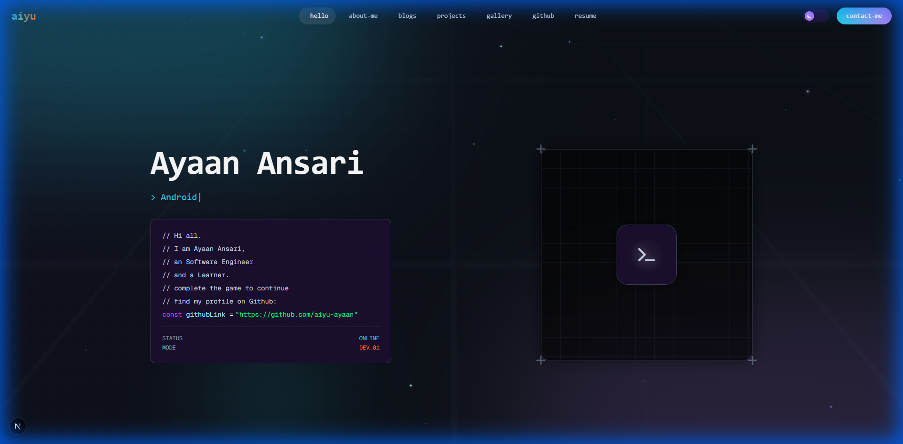
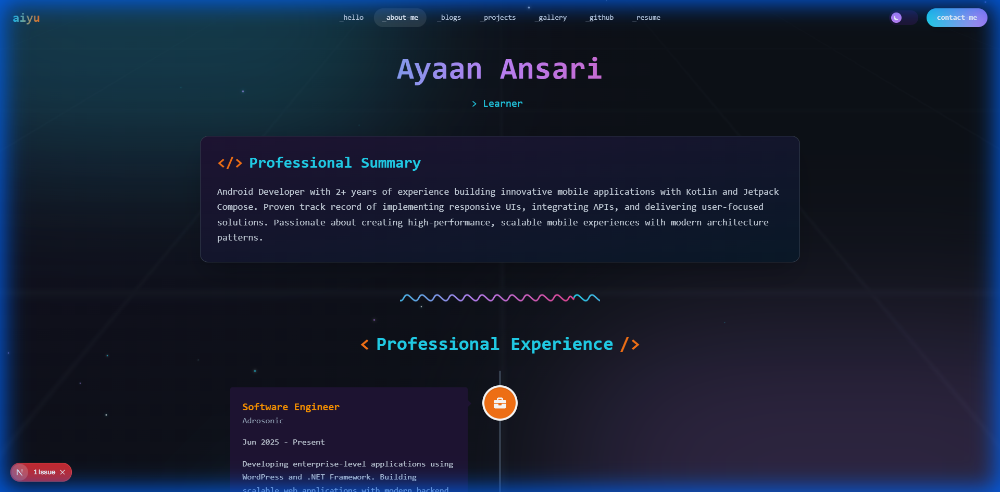
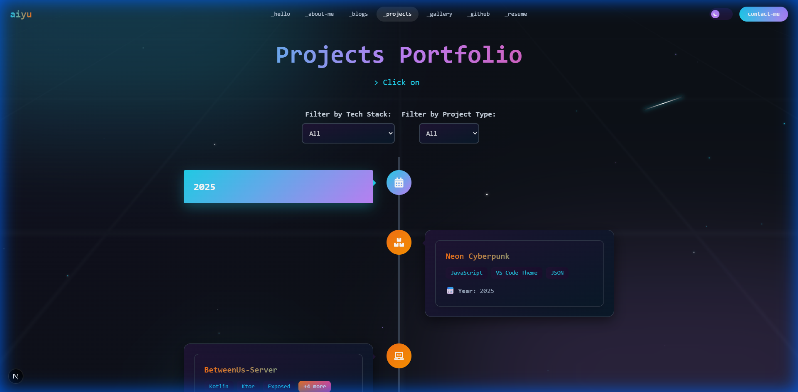
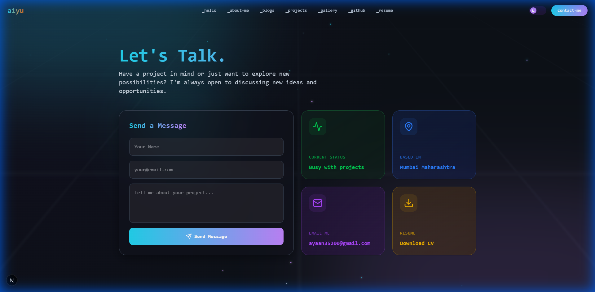
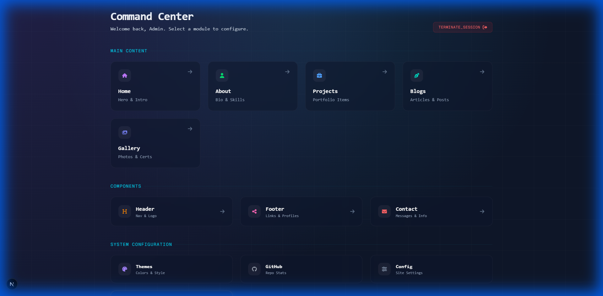

# Portfolio Website

A modern, responsive portfolio website built with Next.js, Tailwind CSS, and MongoDB. This project showcases my skills, detailed project case studies, and provides a way for visitors to contact me. It also features a comprehensive Admin Panel for managing content.

## Features

### Public Interface
- **Home Page**: Interactive landing page with a dynamic space-themed background.
- **About Me**: Detailed introduction and professional background.
- **Projects**: Showcase of my work with detailed project pages.
- **Contact**: Functional contact form for inquiries.
- **Gallery**: A visual collection of achievements and certifications.
- **Blogs**: A section to share thoughts and technical articles.

### Admin Panel
- **Dashboard**: Overview of site activity and statistics.
- **Project Management**: Add, edit, and delete projects.
- **Message Center**: specific section to view and reply to contact form messages (Chat feature).
- **GitHub Integration**: Integration with GitHub for fetching repository data.
- **Database Export**: Functionality to backup/export database records.

## Screenshots

### Home Page


### About Me


### Projects


### Contact Us


### Admin Panel (Homepage)


## Tech Stack

- **Frontend**: Next.js 15 (React 19), Tailwind CSS, Framer Motion
- **Backend**: Next.js API Routes, Mongoose (MongoDB)
- **Utilities**: Lucide React (Icons), date-fns, lodash
- **Deployment**: Vercel (Recommended)

## Getting Started

### Prerequisites

- Node.js (v18 or higher recommended)
- MongoDB Database URI

### Installation

1. **Clone the repository**
   ```bash
   git clone <repository-url>
   cd portfolio
   ```

2. **Install dependencies**
   ```bash
   npm install
   ```

3. **Environment Setup**
   Create a `.env` file in the root directory (copy from `.env.example`).
   ```bash
   cp .env.example .env
   ```
   Fill in your environment variables:
   ```
   MONGODB_URI=your_mongodb_connection_string
   NEXTAUTH_SECRET=your_secret
   # Add other required variables as per .env.example
   ```

4. **Run the development server**
   ```bash
   npm run dev
   ```

   Open [http://localhost:3000](http://localhost:3000) with your browser to see the result.

## Project Structure

- `src/app/(site)`: Public facing pages (Home, About, etc.)
- `src/app/admin`: Admin dashboard and management pages.
- `src/app/api`: Backend API routes.
- `src/components`: Reusable React components.
- `src/models`: Mongoose database models.

## Deployment

This project is optimized for deployment on [Vercel](https://vercel.com).

1. Push your code to a GitHub repository.
2. Import the project into Vercel.
3. Configure the Environment Variables in Vercel settings.
4. Deploy!

## License

This project is licensed under the MIT License.
