# 🌟 Aiyu - The Ultimate Developer Portfolio & CMS

[](https://opensource.org/licenses/MIT)
[](https://nextjs.org/)
[](https://reactjs.org/)
[](https://www.postgresql.org/)
[](https://www.prisma.io/)
[](https://www.docker.com/)
[](https://github.com/aiyu-ayaan/Aiyu/wiki)
[](https://wakatime.com/badge/github/aiyu-ayaan/Aiyu)


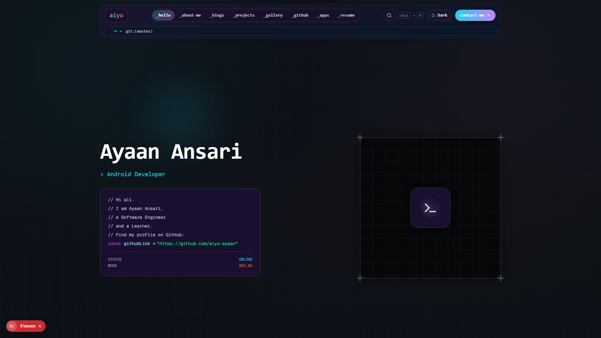

A modern, responsive, and **fully customizable** portfolio website and Content Management System built with **Next.js 16 (App Router)**, **React 19**, **Tailwind CSS 4**, and **PostgreSQL (Prisma ORM)**. 

Featuring a gorgeous space-themed user interface, a highly advanced **Admin Panel**, an integrated **AI Neural Core (Gemini)**, and a visual **Task Scheduler**, `Aiyu` is designed for developers who want a production-ready, security-hardened portfolio with zero-hassle content management.

> [!TIP]
> **📚 Need full guides?** Explore the [Complete Documentation Wiki](https://github.com/aiyu-ayaan/Aiyu/wiki) or jump to the [Quick Start Guide](https://github.com/aiyu-ayaan/Aiyu/wiki/Quick-Start) to get running in 5 minutes!

---

## ✨ Features Spotlight

### 🧠 AI Neural Core (Gemini Integration)
Synthesize content, titles, and layouts directly from your admin panel:
- **AI Theme Architect**: Generate a beautiful, balanced 64+ token custom design system (light & dark modes) from a single concept prompt.
- **Creative Project Synthesis**: Generate catchy project names, write optimized professional summaries, and auto-map tech stacks.
- **Dynamic Subtitle Builder**: Contextually generates engaging subtitles for your projects, blogs, and gallery.

### ⏰ Task Scheduler & Cron Jobs
Full control over background tasks with a custom 60s ticking engine:
- **Visual Builder & Parser**: Select intervals via UI; a real-time translator converts expressions (e.g. `*/15 * * * *`) into human-readable text.
- **Automated Maintenance**: Auto-purge orphaned uploads and optimize heavy PNG/JPG files to highly compressed WebP.
- **Custom Webhook Tasks**: Register API endpoints to execute on schedule, with custom methods, body payloads, and custom headers supporting n8n-style **Fixed/Expression switch toggles**.
- **Global Encrypted Secrets**: Save secure environment variables (`$env.KEY`) globally using secure AES-256 encryption, safely masked (`[SECRET: KEY]`) inside dynamic evaluation previews.
- **Predefined System Variables**: Evaluate context-aware variables dynamically, including `$site` for dynamic site URL mapping and `$device` for host OS/CPU platform specs (e.g., `$device.platform`, `$device.os`).

### 📧 Webhook & Push Dual-Routing
Advanced contact settings for real-time lead routing:
- **Dual Routing**: Forward contact form entries to **n8n Webhook endpoints** and push applications simultaneously.
- **Unified Push Notifications**: Seamlessly routes notifications to **Discord Webhooks**, **Telegram Bots**, or **ntfy Topics** with bearer token support.
- **Route Validation**: Instant one-click connection tests to verify endpoint accessibility.

### 🎨 Live Theme Customizer
- **52 Preset Themes**: Switch between Dracula, Tokyo Night, Nord, Cyberpunk, Catppuccin, and dozens more with a single click.
- **Granular Palette Tuning**: Modify primary, secondary, background, text, and border tokens with immediate live preview.

### 📝 Automated Blog & Masonry Gallery
- **Blog System**: Markdown-based editor with syntax highlighting, auto-saving drafts, and Notion sync API support.
- **Gallery**: Masonry grid layout with auto image optimization and HEIC photo upload compatibility.

### 📄 Resume Studio
Full-screen LaTeX resume IDE with a live PDF preview:
- **Visual & Code Modes**: Edit raw LaTeX or drag-and-drop structured section cards — your choice.
- **AI Assistant**: Refine a selection, auto-fix compile errors, or tailor your resume to a pasted job description.
- **Named Versions & Auto-Everything**: Save snapshots, auto-compile, auto-save, and publish your live resume in one click.

### 🌓 Classic vs V2 Experience
Run two complete site designs side by side:
- **One-Click Default**: Pick which redesign (Classic or V2) visitors land on at the clean URLs.
- **Always Reachable**: The non-default version stays live at `/v1` or `/v2`.
- **V2**: an editorial-depth redesign with numbered chapters, GSAP scroll-driven motion, and terminal-style chrome.

### 🔌 MCP Server & Developer Tools
- **Model Context Protocol Server**: Expose custom tools, resources, and prompts from your portfolio to AI clients, with its own secured write-access token.
- **API Reference Dashboard**: In-app docs for the blog automation API, image uploads, and AI Hub CRUD endpoints.
- **Server Health**: Live CPU/memory/disk/event-loop metrics, uptime monitoring for your deployments, and an AI-powered log analyzer.

---

## 📸 Visual Showcase

| Module | Desktop Dark Mode (1920x1080) | Mobile Dark Mode (430x932) |
|---|---|---|
| **Home Page** | [](public/screenshots/desktop-dark-home.png) | [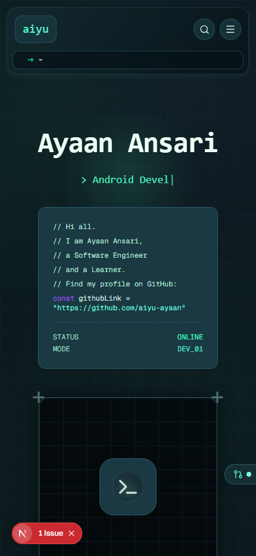](public/screenshots/mobile-dark-home.png) |
| **About Me** | [](public/screenshots/desktop-dark-about.png) | [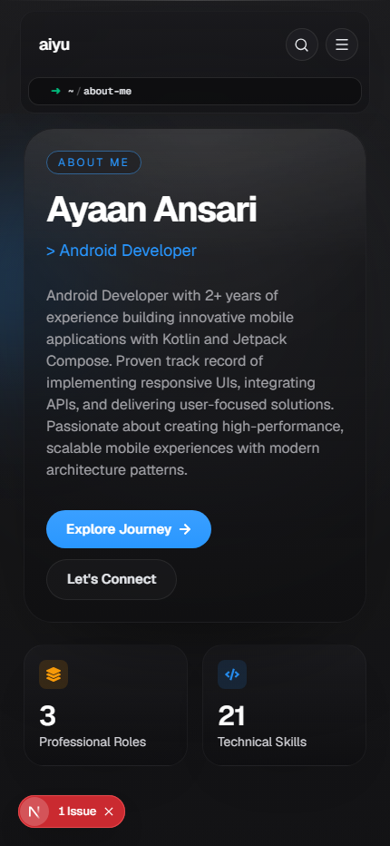](public/screenshots/mobile-dark-about.png) |
| **Projects Showcase** | [](public/screenshots/desktop-dark-projects.png) | [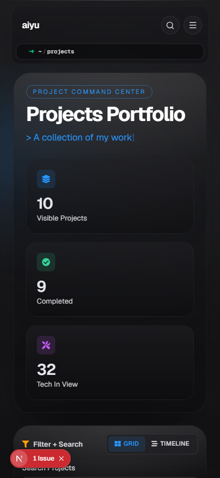](public/screenshots/mobile-dark-projects.png) |
| **Live Deployments / Apps** | [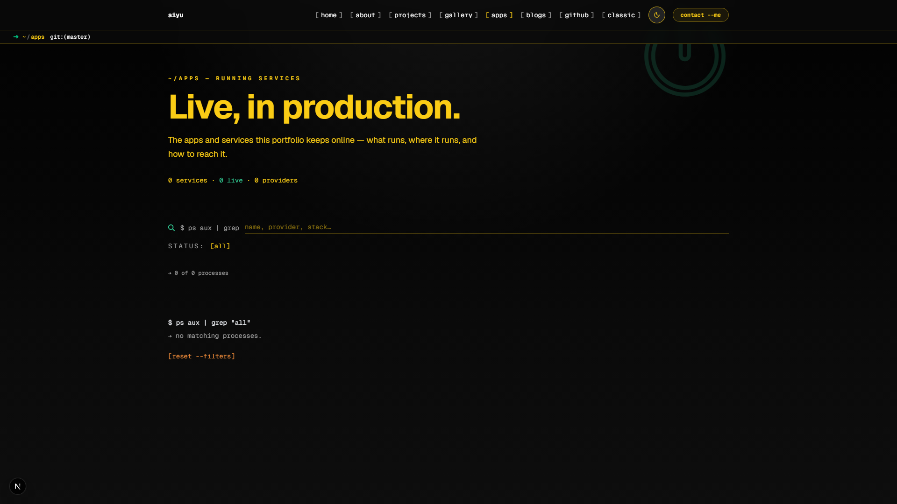](public/screenshots/desktop-dark-apps.png) | [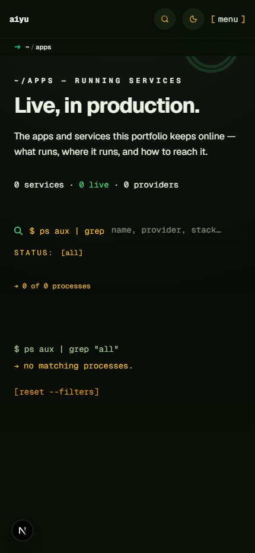](public/screenshots/mobile-dark-apps.png) |
| **Blogs Page** | [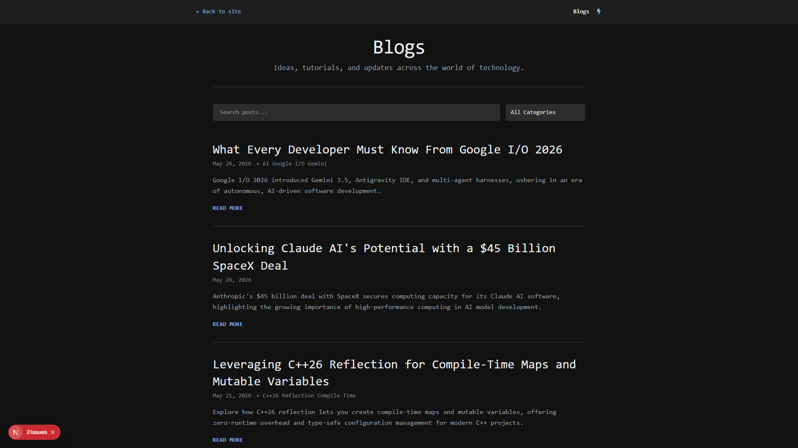](public/screenshots/desktop-dark-blogs.png) | [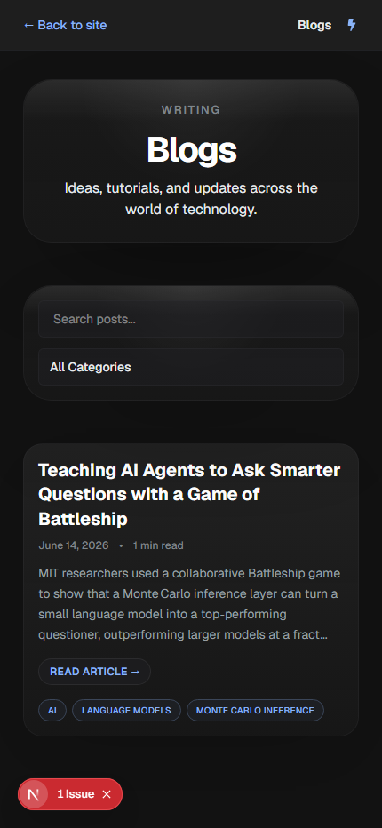](public/screenshots/mobile-dark-blogs.png) |
| **Gallery (Certificates)** | [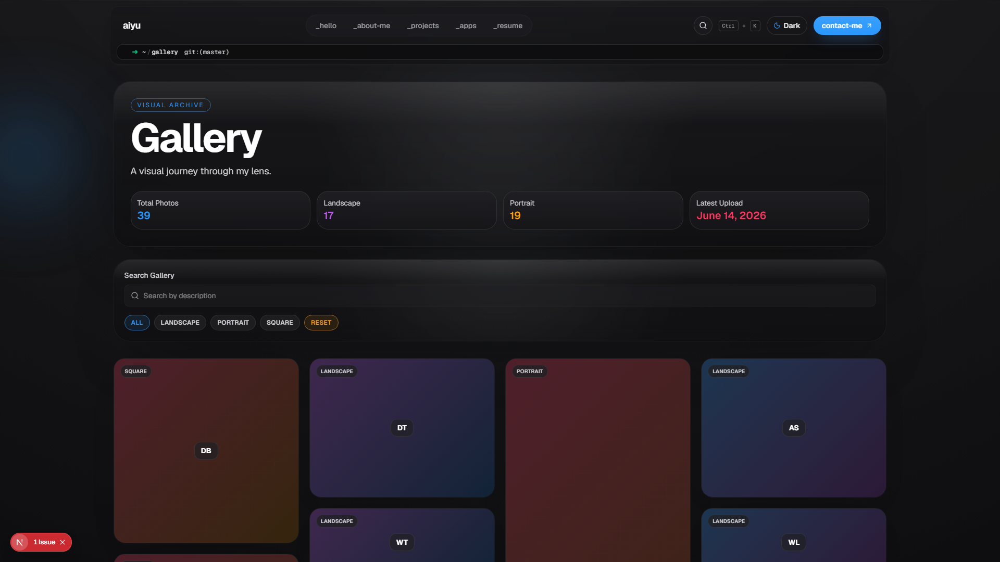](public/screenshots/desktop-dark-gallery.png) | [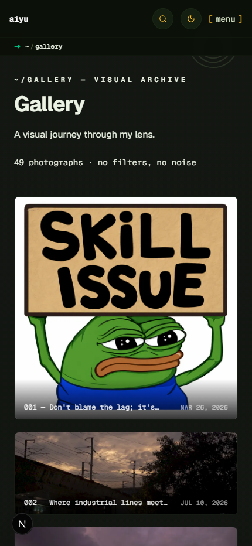](public/screenshots/mobile-dark-gallery.png) |
| **GitHub Activity** | [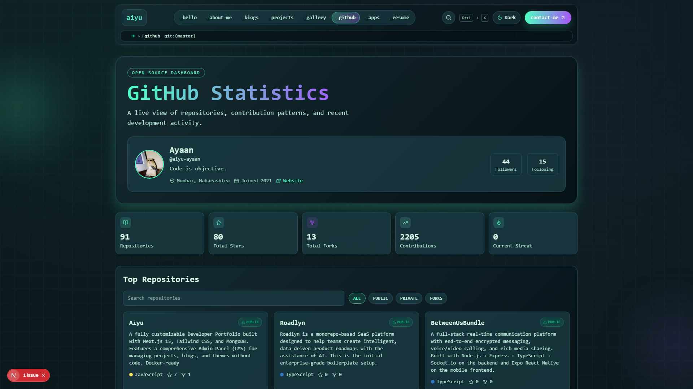](public/screenshots/desktop-dark-github.png) | [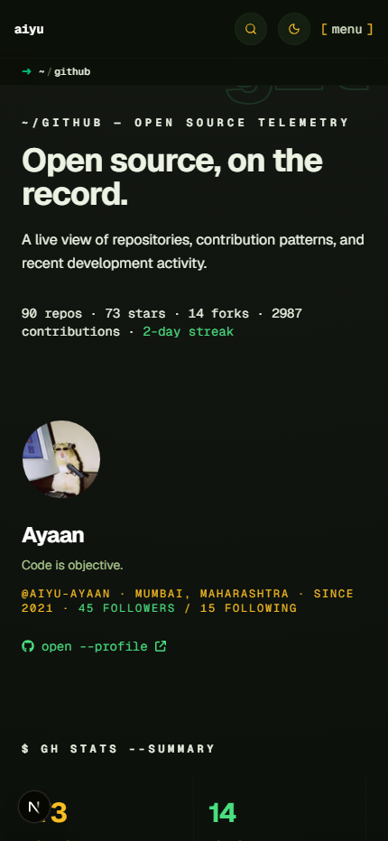](public/screenshots/mobile-dark-github.png) |
| **Contact Us** | [](public/screenshots/desktop-dark-contact.png) | [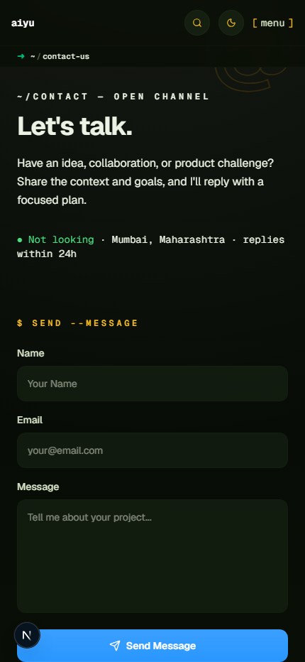](public/screenshots/mobile-dark-contact.png) |
| **Admin Command Center** | [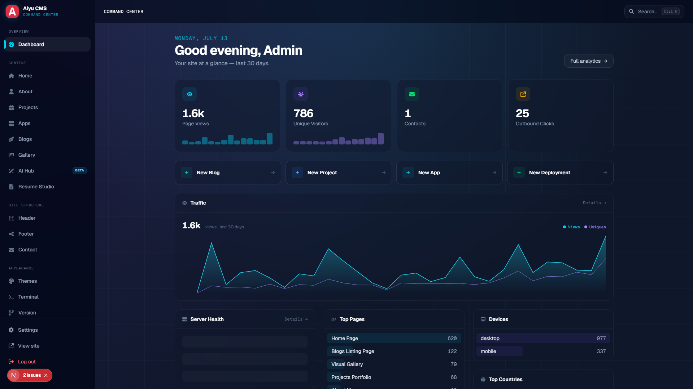](public/screenshots/admin/desktop-dashboard.png) | [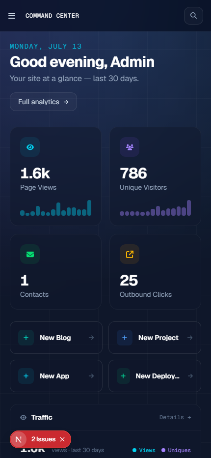](public/screenshots/admin/mobile-dashboard.png) |


## 🚀 Quick Start (Docker Deployment)

The fastest, most secure way to deploy `Aiyu` is using Docker.

### 1. Clone & Configure
```bash
git clone https://github.com/aiyu-ayaan/Aiyu.git
cd Aiyu
cp .env.example .env
```

### 2. Generate Secure Credentials
Run these node commands to generate secure keys for your `.env` file:
```bash
# JWT Secret Key
node -e "console.log('JWT_SECRET=' + require('crypto').randomBytes(64).toString('hex'))"
# PostgreSQL password
node -e "console.log('POSTGRES_PASSWORD=' + require('crypto').randomBytes(24).toString('hex'))"
```
Set `DATABASE_URL` to match your `POSTGRES_USER` / `POSTGRES_PASSWORD` / `POSTGRES_DB`
(use host `postgres` inside Docker, `localhost` for host-based development).

### 3. Build & Deploy
Start all services (App + PostgreSQL + Nginx Proxy):
```bash
npm run docker:build
npm run docker:up
```
> The app container runs `prisma migrate deploy` on startup (`RUN_MIGRATIONS=true`),
> so the schema is created/updated automatically against the Postgres service.
> For a high-availability primary + read-replica Postgres topology, use
> `docker compose -f docker-compose.replication.yml up -d` instead.

### 4. Verify Security Hardening
Check if non-root user settings, read-only root system, and miner-prevention capabilities are active:
```bash
npm run docker:verify
```

### 5. Access and Seed
Visit the link or run a curl request to populate your fresh database:
```bash
curl http://localhost/api/seed
```
- **Portfolio**: [http://localhost](http://localhost)
- **Admin Panel**: [http://localhost/admin](http://localhost/admin)

---

## 💻 Local Development (host + Dockerized Postgres)

Run Next.js and the Prisma CLI directly on your machine, with only PostgreSQL
(and optional pgAdmin) in Docker:

```bash
cp .env.example .env.local         # set DATABASE_URL to localhost
npm install                        # postinstall runs `prisma generate`
npm run db:up                      # start Postgres + pgAdmin (docker-compose-dev.yml)
npx prisma migrate deploy          # apply the schema
npm run db:seed                    # populate sample data (or curl /api/seed)
npm run dev                        # http://localhost:3000
```

Useful scripts: `npm run db:studio` (Prisma Studio), `npm run db:down` (stop the
dev database). pgAdmin is available at `http://localhost:5050`.

---

## 🧪 Running Tests

Unit & component tests (Vitest + Testing Library):

```bash
npm test          # run once
npm run test:watch
```

UI / end-to-end tests (Playwright — auto-starts the dev server with real clicks):

```bash
npm run test:ui          # headless
npm run test:ui:headed   # watch the browser
```

Run everything: `npm run test:all`.

The admin e2e reads `ADMIN_USERNAME` / `ADMIN_PASSWORD` from `.env` (same as the
screenshot script); the valid-login test is skipped if `ADMIN_PASSWORD` is unset.

---

## 🛠️ The Tech Stack

- **Core**: Next.js 16 (App Router), React 19, Tailwind CSS 4, Framer Motion
- **Database**: PostgreSQL 17 with Prisma ORM (Postgres full-text search for blogs)
- **Image Processing**: Sharp (with HEIC support)
- **Authentication**: JWT (`jose`), AES-256 encrypted secrets storage
- **Security Protocols**: Non-root execution, Capability dropping, `noexec /tmp` directory, rate limiting, and secure headers.
- **Testing & Tooling**: Playwright, ESLint

---

## 📖 Deep-Dive Documentation Wiki

- ⚡ **[Quick Start](https://github.com/aiyu-ayaan/Aiyu/wiki/Quick-Start)** - Get running in 5 minutes.
- 🔧 **[Admin Manual](https://github.com/aiyu-ayaan/Aiyu/wiki/Admin-Panel-Manual)** - Complete dashboard usage guide with images.
- 🐳 **[Deployment Guide](https://github.com/aiyu-ayaan/Aiyu/wiki/Deployment-Guide)** - Scale out to cloud instances and VPS.
- 🔒 **[Security Hardening](https://github.com/aiyu-ayaan/Aiyu/wiki/Security-Guide)** - Enterprise safety best practices.
- 📊 **[API Specification](https://github.com/aiyu-ayaan/Aiyu/wiki/API-Documentation)** - Full REST endpoints usage reference.

---

**Licensed under [MIT](LICENSE)** • Maintained by [Aiyu Ayaan](https://github.com/aiyu-ayaan) and the Open-Source Community.
