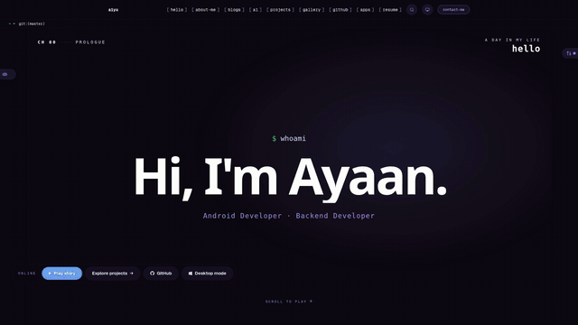

# Documentation Files

> **📚 All documentation has moved to the GitHub Wiki**
>
> **Visit**: **[GitHub Wiki](https://github.com/aiyu-ayaan/Aiyu/wiki)**

---

## Why the Move?

The documentation has been migrated to GitHub Wiki for:
- ✅ Better organization and navigation
- ✅ Searchable content
- ✅ Community contributions
- ✅ Version control
- ✅ Always up-to-date

## Available Documentation

### Getting Started
- **[Quick Start](https://github.com/aiyu-ayaan/Aiyu/wiki/Quick-Start)** - 5-minute setup
- **[Installation Guide](https://github.com/aiyu-ayaan/Aiyu/wiki/Installation-Guide)** - Detailed setup
- **[Configuration](https://github.com/aiyu-ayaan/Aiyu/wiki/Configuration)** - Environment variables
- **[Database Seeding](https://github.com/aiyu-ayaan/Aiyu/wiki/Database-Seeding)** - Initial data

### Features & Usage
- **[Admin Panel Manual](https://github.com/aiyu-ayaan/Aiyu/wiki/Admin-Panel-Manual)** - With screenshots
- **[Content Management](https://github.com/aiyu-ayaan/Aiyu/wiki/Content-Management)** - Managing content
- **[Theme Customization](https://github.com/aiyu-ayaan/Aiyu/wiki/Theme-Customization)** - Themes
- **[GitHub Integration](https://github.com/aiyu-ayaan/Aiyu/wiki/GitHub-Integration)** - Repository stats

### Development
- **[API Documentation](https://github.com/aiyu-ayaan/Aiyu/wiki/API-Documentation)** - REST API
- **[Architecture](https://github.com/aiyu-ayaan/Aiyu/wiki/Architecture)** - Project structure
- **[Contributing Guide](https://github.com/aiyu-ayaan/Aiyu/wiki/Contributing-Guide)** - How to contribute

### Deployment
- **[Deployment Guide](https://github.com/aiyu-ayaan/Aiyu/wiki/Deployment-Guide)** - Production deployment
- **[Docker Setup](https://github.com/aiyu-ayaan/Aiyu/wiki/Docker-Setup)** - Docker configuration
- **[Security Guide](https://github.com/aiyu-ayaan/Aiyu/wiki/Security-Guide)** - Security best practices
- **[Monitoring](https://github.com/aiyu-ayaan/Aiyu/wiki/Monitoring)** - Health checks

### Optimization
- **[SEO Optimization](https://github.com/aiyu-ayaan/Aiyu/wiki/SEO-Optimization)** - SEO techniques
- **[SEO Testing](https://github.com/aiyu-ayaan/Aiyu/wiki/SEO-Testing)** - Testing tools
- **[Gallery Optimization](https://github.com/aiyu-ayaan/Aiyu/wiki/Gallery-Optimization)** - Image optimization

### Help
- **[Common Issues](https://github.com/aiyu-ayaan/Aiyu/wiki/Common-Issues)** - FAQ and troubleshooting
- **[Debugging](https://github.com/aiyu-ayaan/Aiyu/wiki/Debugging)** - Debugging tips

---

## Local Files (Legacy)

The files in this `docs/` folder now serve as redirects to the wiki. They contain:
- Brief overview
- Quick links to wiki pages
- Screenshots (in `docs/images/`)

**For the most up-to-date and complete documentation, always refer to the [GitHub Wiki](https://github.com/aiyu-ayaan/Aiyu/wiki).**

---

## Story Videos

The v2 home page tells my life story as a scroll-driven film, from the hero to chapter 09. These recordings come straight from the production build (`npm run record`, 2× speed).

<table>
  <tr>
    <th>Desktop</th>
    <th>Mobile</th>
  </tr>
  <tr>
    <td><a href="../journey-desktop.mp4"></a></td>
    <td><a href="../journey-mobile.mp4"></a></td>
  </tr>
</table>

The previews run at 3× the recording. Click one to watch the full 2× MP4 in GitHub's player: [journey-desktop.mp4](../journey-desktop.mp4) · [journey-mobile.mp4](../journey-mobile.mp4).

Re-record both with `npm run record` (options: `--speed`, `--device desktop|mobile`, `--fps`, `--skip-build`; see `scripts/record-story.mjs`).

---

## Screenshots

Screenshots are still available in `docs/images/` and are referenced in the wiki using raw GitHub URLs:

```markdown

```

---

**Visit the [GitHub Wiki](https://github.com/aiyu-ayaan/Aiyu/wiki) for complete documentation**
