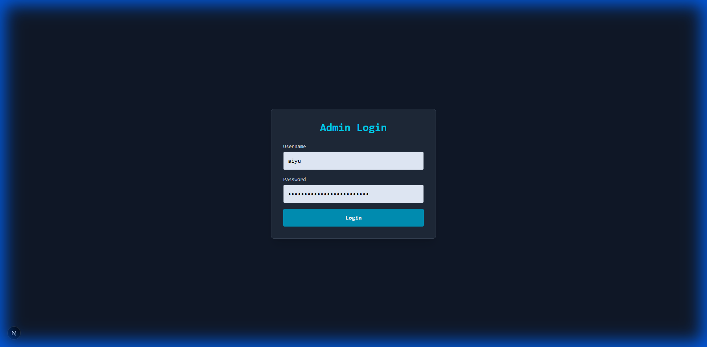
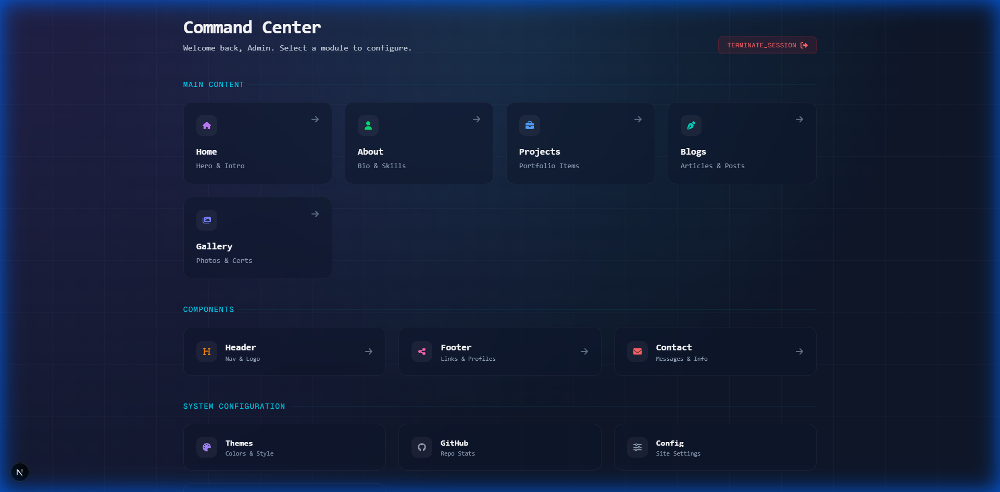
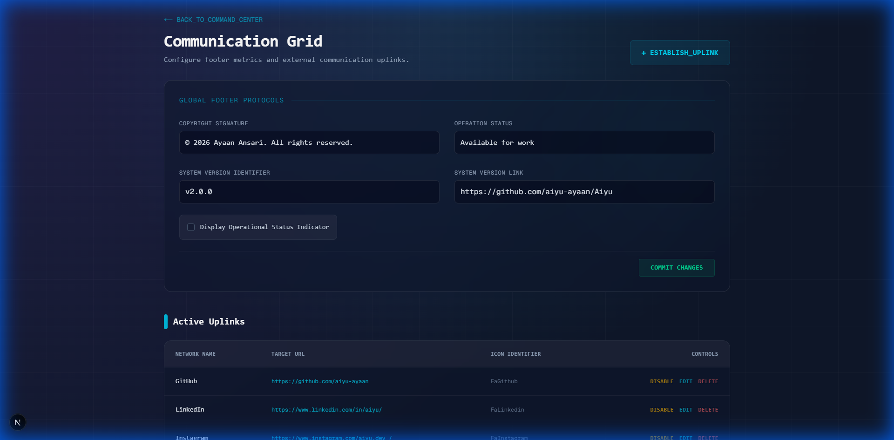

# Admin Panel User Manual

This document provides a comprehensive guide to using the Portfolio Admin Panel. The system allows you to manage content, configurations, and themes without writing code.

---

## Table of Contents

1.  [Access & Authentication](#access--authentication)
2.  [Command Center (Dashboard)](#command-center-dashboard)
3.  [Main Content Modules](#main-content-modules)
    *   [Home](#home)
    *   [About](#about)
    *   [Projects](#projects)
    *   [Blogs](#blogs)
    *   [Gallery](#gallery)
4.  [Component Modules](#component-modules)
    *   [Header](#header)
    *   [Footer](#footer)
    *   [Contact](#contact)
5.  [System Configuration](#system-configuration)
    *   [Themes](#themes)
    *   [GitHub](#github)
    *   [Config](#config)
    *   [Database](#database)

---

## Access & Authentication

**URL**: `/admin`  
**Login URL**: `/admin/login`

The admin panel is protected by a secure authentication system.

### Login Screen


*   **Rate Limiting**: The system allows 5 attempts every 5 minutes per IP address to prevent brute-force attacks.
*   **Security**: Ensure `ADMIN_PASSWORD` is set securely in your `.env` file.

---

## Command Center (Dashboard)

**URL**: `/admin`

The Command Center is the landing page after a successful login. It provides a visual grid of all available administration modules.

### Dashboard Overview


*   **Main Content**: Primary pages visible to visitors.
*   **Components**: Reusable sections like Header and Footer.
*   **System Configuration**: Global settings, themes, and backups.
*   **Terminate Session**: Use the logout button in the top right to securely exit.

---

## Main Content Modules

### Home
**URL**: `/admin/home`

Manage the landing page visuals and text.
*   **Hero Section**: Update the main headline ("I'm Ayaan...") and subtext.
*   **Availability**: Toggle your "Open to Work" status.

### About
**URL**: `/admin/about`

Manage your biography and skills.
*   **Bio**: Markdown-supported text area for your introduction.
*   **Skills**: Add or remove technologies (e.g., React, Node.js) displayed in the skills grid.

### Projects
**URL**: `/admin/projects`

Manage your portfolio case studies.
*   **List View**: See all active projects.
*   **Editor**:
    *   **Slug**: Automatic or custom URL slug.
    *   **Images**: Upload main project images.
    *   **Tech Stack**: Tag technologies used.
    *   **Content**: Full Markdown editor for case study details.

### Blogs
**URL**: `/admin/blogs`

Manage technical articles and thoughts.
*   **Editor**: Markdown-based editor with preview.
*   **Tags**: Categorize posts for easier filtering.
*   **Status**: Save as Draft or Publish immediately.

### Gallery
**URL**: `/admin/gallery`

Upload and manage certifications, photos, or awards.
*   **Upload**: Drag-and-drop interface for images.
*   **Captions**: Add context to each image.

---

## Component Modules

### Header
**URL**: `/admin/header`

Configure the main navigation bar.
*   **Logo Text**: Change the name displayed in the top left.
*   **Nav Items**: Enable/disable specific links in the menu.

### Footer
**URL**: `/admin/footer` (formerly Socials)

Manage the website footer and external links.



*   **Global Protocols**:
    *   **Copyright Signature**: Custom text (e.g., "© 2025").
    *   **System Version**: Display a version tag (e.g., "v2.0").
    *   **System Version Link**: URL for the version tag (e.g., to GitHub release).
    *   **Operational Status**: Toggle "All Systems Nominal" verified badge.
*   **Active Uplinks**: Manage social media links (GitHub, LinkedIn, etc.) with icon support.

### Contact
**URL**: `/admin/contact`

View and manage incoming messages.
*   **Inbox**: Read messages sent via the contact form.
*   **Status**: Mark messages as Read/Unread.
*   **Delete**: Remove spam or processed inquiries.

---

## System Configuration

### Themes
**URL**: `/admin/themes`

Control the visual appearance of the portfolio.


*   **Preset Themes**: Select from built-in high-quality themes:
    *   **Dracula**, **Nord**, **Cyberpunk**
    *   **Gruvbox**, **Solarized**, **Catppuccin**
*   **Custom Theme**: Create your own color palette using the color pickers.
*   **Live Preview**: Instantly see changes before saving.

### GitHub
**URL**: `/admin/github`

Configure the GitHub integration.
*   **Username**: Set the GitHub username to fetch stats from.
*   **Token**: (Optional) Personal Access Token for higher rate limits.

### Config
**URL**: `/admin/config`

General site-wide settings.
*   **SEO**: Global meta tags and descriptions.
*   **Analytics**: Google Analytics ID configuration.
*   **Feature Flags**: Enable/disable major sections of the site globally.

### Database
**URL**: `/admin/database`

Manage your data.
*   **Backup**: One-click export of all data (Projects, Blogs, Config) to a JSON file.
*   **Restore**: (Advanced) Restore data from a backup file.

---

## Directory Structure
To help you find screenshots, here is the suggested directory structure:

```
docs/
  ├── admin_manual.md  (This file)
  └── images/
      ├── admin-login.png
      ├── admin-dashboard.png
      ├── admin-footer.png
      ├── admin-themes.png
      └── ... (add others as needed)
```
